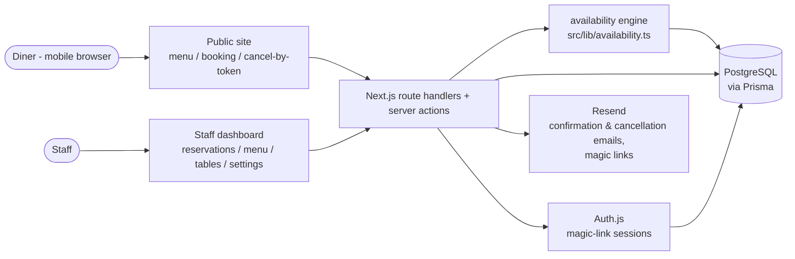
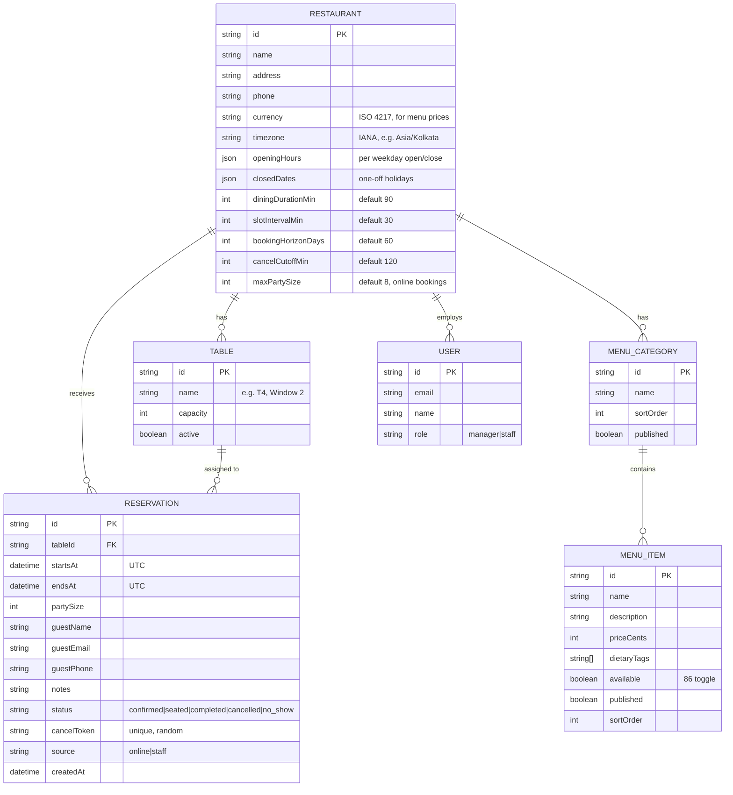

# RestroReserve — Design & Architecture

> Living document. Update when architecture or key decisions change, and log the change in CONVERSATION_LOG.md.

## Architecture Overview

RestroReserve is a single Next.js application serving three surfaces: the public site (menu, booking flow, tokenized reservation pages), the staff dashboard (behind Auth.js sessions), and API route handlers that both surfaces call. All state lives in one PostgreSQL database accessed through Prisma.

The correctness-critical path is booking creation: the availability engine (`src/lib/availability.ts`) computes free slots from opening hours, tables, and existing reservations, and booking confirmation runs in a database transaction that re-checks for overlaps before committing — the UI's availability display is advisory, the transaction is the source of truth. Transactional email (confirmations, cancellations, staff magic links) goes out through Resend; email failures are logged and retried but never roll back a committed booking.

Timezone handling is centralized: everything is stored in UTC, and the restaurant's IANA timezone (a `Restaurant` field) is applied only when computing slot boundaries and rendering times.

## Tech Stack & Rationale

| Layer | Choice | Why |
|---|---|---|
| Frontend + backend | Next.js (App Router) + TypeScript | One boring, well-documented framework for all three surfaces; fits a solo/AI-driven workflow |
| Styling | Tailwind CSS | Fast mobile-first iteration; no separate design-system overhead at MVP |
| Database | PostgreSQL (Neon) | Relational model fits reservations/tables; transactions + constraints prevent double-booking |
| ORM | Prisma | Typed queries, migrations, seed tooling |
| Auth | Auth.js (NextAuth v5), email magic links | Staff-only auth without password storage; diners stay account-free |
| Email | Resend | Simple transactional API; also delivers Auth.js magic links |
| Testing | Vitest + Playwright | Fast unit tests for slot math; e2e for the one critical booking flow |
| Hosting | Vercel | Zero-config Next.js deploys with preview environments |

## Data Model

Core entities: `Restaurant` (single row in MVP; keeps multi-restaurant feasible), `Table`, `MenuCategory`, `MenuItem`, `Reservation`, and `User` (staff only). Diners are not users — their contact details live on the reservation, and they access it via `cancelToken`.

Integrity rules (enforced in the database, not just app code):

- Unique index on `Reservation.cancelToken`.
- Overlap guard (as built): a Postgres exclusion constraint — `btree_gist` on (`tableId`, `tstzrange(startsAt, endsAt)`), filtered to `confirmed`/`seated` — is the *authoritative* guard; a single reservation INSERT is atomic against it, so no wrapping transaction is needed. The availability recompute before insert is an advisory pre-check only, and the booking code retries the next candidate table when the constraint fires. Do not "add" a SERIALIZABLE/`FOR UPDATE` layer on top — it would only add complexity over what the constraint already guarantees.
- `endsAt = startsAt + diningDuration` computed server-side, never client-supplied.

## API Design

All routes are Next.js route handlers / server actions. "Staff" auth = valid Auth.js session; "Token" = valid `cancelToken` in the URL/body.

| Method | Path | Purpose | Auth |
|---|---|---|---|
| GET | `/api/menu` | Published menu for the public site | none |
| GET | `/api/availability?date=&partySize=` | Free slots for a date + party size | none |
| POST | `/api/reservations` | Create a booking (rate-limited) | none |
| GET | `/api/reservations/[cancelToken]` | View one reservation | Token |
| POST | `/api/reservations/[cancelToken]/cancel` | Diner cancellation (respects cut-off) | Token |
| GET | `/api/dashboard/reservations?date=` | List reservations for a date | Staff |
| POST | `/api/dashboard/reservations` | Staff-created (walk-in/phone) booking | Staff |
| PATCH | `/api/dashboard/reservations/[id]` | Edit / set status / cancel | Staff |
| CRUD | `/api/dashboard/menu/**` | Categories & items management | Staff |
| CRUD | `/api/dashboard/tables/**` | Table setup | Staff |
| PATCH | `/api/dashboard/settings` | Restaurant profile, hours, policies | Staff |
| * | `/api/auth/**` | Auth.js magic-link endpoints | — |

## UI / UX Notes

Key screens:

1. **Home / menu** (public) — restaurant identity, hours, and the menu by category; primary CTA "Book a table".
2. **Booking flow** (public) — date → party size → available time slots → contact details → confirmation. One screen per step on mobile.
3. **Reservation page** (public, tokenized) — details + cancel button, or the "past cut-off, call us" state.
4. **Dashboard: Today** (staff) — today's reservations by time with status actions; date switcher.
5. **Dashboard: Menu** (staff) — category/item list with inline edit, availability ("86") toggle, publish state, drag-to-reorder.
6. **Dashboard: Tables & Settings** (staff) — table list with capacities; opening hours, closed dates, booking policies, profile.

Look and feel: warm, appetite-appealing palette with generous food imagery on the public site; mobile-first throughout. The dashboard favors density and speed over polish — it's a tool used mid-service.

## Security & Privacy Considerations

- **Auth:** staff-only login via Auth.js email magic links; every dashboard route and mutation verifies the session server-side. Diners never authenticate — reservation access is exclusively via a cryptographically random `cancelToken` (≥128 bits, unique-indexed, never derived from PII).
- **Sensitive data:** diner PII (name, email, phone, notes — notes may contain health info like allergies). Protections: no PII in logs, URLs (tokens only), or error messages; API responses scoped to the single reservation the token grants; TLS everywhere (platform default).
- **Top threats to design against:**
  1. *Double-booking / availability races* — two diners confirming the same table-slot concurrently; mitigated at the transaction/constraint level (see Data Model), verified by a concurrency test.
  2. *IDOR on reservations* — guessing IDs/tokens to read or cancel others' bookings; mitigated by random tokens, token-scoped queries, and staff-session checks on dashboard routes.
  3. *Booking spam* — scripted fake reservations exhausting availability; mitigated by rate limiting on `POST /api/reservations` plus staff tools to cancel in bulk.

## Key Decisions & Trade-offs

| Decision | Alternatives considered | Why this one |
|---|---|---|
| Single-restaurant MVP | Multi-restaurant marketplace | Matches the description's simplest reading; `Restaurant` entity keeps the door open (PRD §9.1) |
| Next.js full-stack monolith | Separate SPA + API service | One deployable, one repo, fewer moving parts for MVP |
| No diner accounts; tokenized links | Diner login with booking history | Removes password/PII surface; email link covers view/cancel needs |
| Auth.js magic links for staff | Passwords, Google OAuth | No password storage; works with only the email provider already needed |
| Postgres + Prisma, overlap enforced in DB | App-level checks only; SQLite | Double-booking is the product's core invariant — enforce where races can't slip through |
| Vercel + Neon | Fly.io/Railway container | Zero-config for Next.js, free tier fits MVP; revisit if long-running jobs appear |
| Email-only notifications (Resend) | SMS (Twilio) | Cheaper, simpler; SMS deferred to PRD §6 |

All of the above were made during scaffolding as assumptions, not mandates — revisit freely with the product owner.
