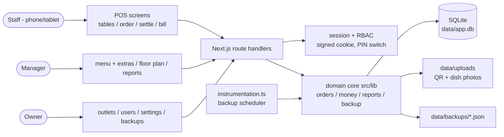
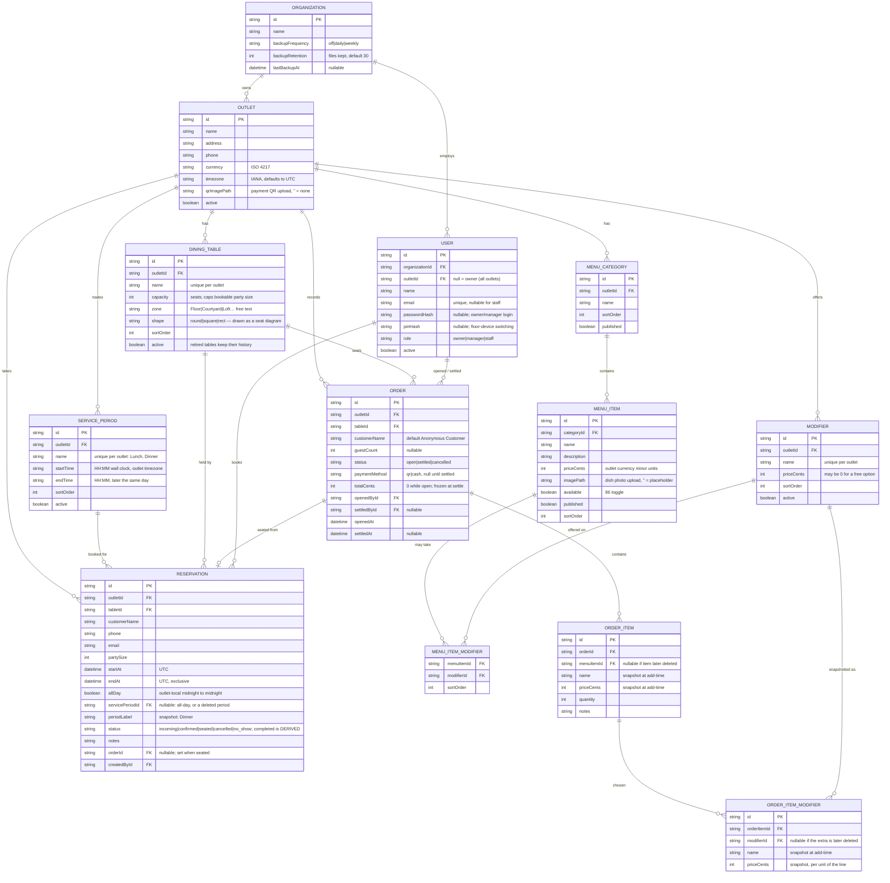
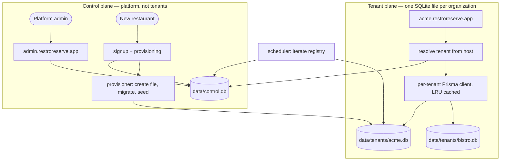

# RestroReserve — Design & Architecture

> Living document, rewritten 2026-07-28 for the POS pivot. Update when architecture or key decisions change, and log the change in CONVERSATION_LOG.md. The v1 diner-booking architecture is in git history.

## Architecture Overview

RestroReserve is one codebase producing two Next.js applications. **`apps/onsite`** is the self-hosted build described throughout this document; **`apps/cloud`** is the hosted multi-tenant service, which differs only in its database (Postgres over the pure-JavaScript `pg` driver), where it stores files, and the tenant-facing concerns layered on top — signup, branding, subscription. The rules both obey live in `packages/domain`, and the data model in `packages/db/models.prisma`, from which each app's schema is generated for its own provider. What follows describes the onsite build unless it says otherwise.

The onsite build is a single self-hosted Next.js application backed by a local SQLite database. It is deployed on a machine the restaurant controls (a mini-PC, laptop, or cheap VPS); staff devices — phones and tablets on the same network — use it through the browser. There is no external service dependency at runtime: auth, data, uploads (payment QR and dish photos), and backups all live on that machine under a single `data/` directory, which makes "back up the restaurant" a tractable, ownable problem.

Requests carry a signed cookie holding two independent facts: which outlet the **device** is paired to, and who is **currently acting** on it. An owner or manager pairs a tablet once with their email and password; from then on staff sign themselves in and out with a 4-digit PIN as many times as a shift requires, because ending a shift clears only the acting user and leaves the pairing intact. (Collapsing the two would mean a waiter tapping "sign out" stranded the till until someone with a password walked over — staff have no password by design.) Only an explicit manager-level "unpair" forgets the outlet. Every API route resolves the session first and scopes every query by the session's organization and outlet; tenant isolation is a property of the data-access layer (`src/lib/`), not of individual pages.

The domain core is the order lifecycle: seating a table opens an `Order`; menu picks append `OrderItem` rows that snapshot name and price at add-time; settling freezes the total onto the order, records method and settler, and — because table occupancy is *derived from the existence of an open order*, not stored — the table frees itself atomically with settlement. Reports read the same frozen totals the bills printed, so the two can never disagree. Alongside it sits the booking lifecycle: a `Reservation` holds one table for a UTC window, "reserved" is derived the same way occupancy is, and seating a booking opens the order and links the two. A lightweight in-process scheduler (started via Next.js `instrumentation.ts`) runs owner-configured daily/weekly JSON backups into `data/backups/`.



## Tech Stack & Rationale

| Layer | Choice | Why |
|---|---|---|
| App framework | Next.js 16 (App Router) + TypeScript | Kept from v1; one deployable serves UI + API on LAN |
| Styling | Tailwind CSS v4, Chulho design tokens | Owner approved the v1 look and it stays; the owner's 2026-07-29 screenshots supplied **layouts**, which the screens now follow, rendered in these tokens |
| Database | SQLite via Prisma 7 (`@prisma/adapter-better-sqlite3`) | "Local database" requirement: single file, zero admin, easy backup; POS write volume is one outlet's staff, well within SQLite's envelope |
| Auth | Hand-rolled sessions: `jose` (signed JWT cookie) + `bcryptjs` (password & PIN hashes) | Magic links died with the diner site; credentials+PIN on a shared device doesn't fit Auth.js providers cleanly |
| Validation | Zod 4 at every API edge | Kept from v1 |
| Timezone math | `@date-fns/tz` | Report day-bucketing in outlet-local time |
| Testing | Vitest (+ Playwright walkthroughs) | Kept from v1 |
| Hosting | Self-hosted node process (mini-PC/VPS), see DEPLOY.md | Local-first is a product requirement, not a constraint |

Dropped from v1: PostgreSQL (+ exclusion constraint), Resend/email, Auth.js, the availability/slot engine. The double-booking exclusion constraint does not translate to SQLite — and doesn't need to: concurrent seating of one table by many anonymous internet users was a v1 problem; in the POS, seating is staff-driven and guarded by a transactional check (see Integrity rules).

## Data Model

Tenancy chain: `Organization` (the owner's business) → `Outlet` → everything else. Users belong to the organization; staff and managers are pinned to one outlet, owners have `outletId = null` (all outlets).



Integrity rules (enforced in `src/lib/`, verified by tests):

- **Table occupancy is derived, never stored**: a table is occupied iff it has an order with `status = "open"`. Settling/cancelling releases it atomically; there is no second source of truth to drift.
- **"Reserved" is derived too, and independent of occupancy**: a table is reserved at instant T iff a `booked` reservation covers T (or starts within `RESERVATION_LEAD_MINUTES`). No status column was added — the two states are orthogonal, so a table can be occupied by a walk-in *and* carry a hold for later tonight, which is what actually happens in service.
- **Bookings are taken by service period, not by clock time**: the API accepts `servicePeriodId` or `allDay` and refuses a raw window. The chosen period's wall-clock times resolve against the outlet's timezone into the UTC `[startAt, endAt)` the row stores, so every rule below still reasons in instants. The period's **name and window are snapshotted** onto the booking (`periodLabel`), so retiming "Dinner" from 18:00 to 19:00 leaves tonight's bookings exactly where they were — the same law as a menu edit not rewriting a printed bill.
- **A hold covering now marks the table taken, but nothing is locked**: the board renders a table whose window covers this instant in the occupied treatment (owner's call, 2026-07-29) so a party is never walked onto a held table by accident. `seatTable` still succeeds — the board's job is to warn; refusing service over a database row would be worse than the paper it replaced.
- **Bookings can't overlap, but never block seating**: overlap is refused at booking time by a check-then-insert inside one transaction (SQLite's single writer makes it airtight, as with seating), over half-open `[startAt, endAt)` windows so back-to-back bookings don't collide. Seating is never refused on account of a booking — a walk-in at a reserved table is the host's call, and software that stranded paying customers over a database row would be wrong. The overlap check counts `booked` **and** `seated` rows (a seated party still owns its window); the board's hold counts only `booked` (a seated booking must not keep offering "tap to seat").
- **One open order per table**: seating runs in a transaction that re-checks for an existing open order on the table before insert. SQLite's single-writer model makes this airtight.
- **Snapshots are law**: `OrderItem.name/priceCents` are copied at add-time; menu edits and deletions never touch existing orders. `menuItemId` is kept only as a soft pointer. **Chosen extras snapshot identically** into `OrderItemModifier`, so renaming or repricing "Bacon" leaves every printed bill exactly as it was.
- **Extras are priced per unit and validated against the dish**: a line costs `(item + Σ extras) × quantity` via `lineTotalCents`, and the API takes extra **ids** only — resolved through the item's own `MenuItemModifier` allow-list, so a client can neither invent a price nor attach an extra the dish doesn't offer (nor one from another outlet).
- **Booking `completed` is derived**: stored statuses are `incoming|confirmed|seated|cancelled|no_show`; a seated booking *displays* as completed once its linked order is settled (`displayReservationStatus`). Storing it would mean a second write at settle time and a card that could drift from the bill.
- **Totals are frozen at settle**: `Order.totalCents` is written once, inside the settle transaction, from the line snapshots; bills and reports read it — nothing recomputes money after settlement. Settle/cancel are guarded updates (`WHERE status = 'open'`) so double-settles lose harmlessly.
- **Tenancy in the data layer**: every domain function takes the session's `organizationId`/`outletId` and includes them in its WHERE clauses; API code cannot forget what the lib never lets it omit. SQLite has no enums/arrays — allowed string values are constants validated by Zod at the edges.
- **The database handle travels with the tenancy ids**: domain functions query through `ctx.db`, and `src/lib/db.ts` exports no client singleton — only `resolveDb()`, which the session resolver calls once per request. Callers with no session (the backup scheduler) resolve one and pass `{ db, orgId }` explicitly. Removing the shared `prisma` export is what makes "which database does this write land in?" a compile-time question rather than a convention; see "Proposed: Hosted Multi-Tenant Platform" for the change this seam exists to absorb.

## API Design

All routes under `/api`, JSON in/out, Zod-validated, session-scoped. Role column = minimum role; every route also enforces org/outlet scope from the session.

| Method | Path | Purpose | Min role |
|---|---|---|---|
| POST | `/api/auth/login` | Email + password → pairs the device to an outlet and signs in (owner may pass outletId) | — |
| POST | `/api/auth/pin` | `{userId, pin}` → sign in / hand over on a paired device | paired device |
| POST | `/api/auth/logout` | End the shift; device stays paired | any |
| POST | `/api/auth/unpair` | Forget the outlet — device needs a password again | manager |
| GET | `/api/auth/session` | Who is on (or null) / outlet / who can PIN in | paired device |
| GET | `/api/tables` | Table board: tables + open-order summaries + current holds | staff |
| POST | `/api/tables` · PATCH · DELETE `[id]` | Floor plan: add/edit/retire tables (delete only without history) | manager |
| GET | `/api/reservations?date` | One outlet-local day's bookings | staff |
| POST | `/api/reservations` | Book a table `{tableId, customerName, partySize, date, servicePeriodId \| allDay, phone?, email?, notes?}` — never a clock time | staff |
| GET | `/api/settings/service-periods` | The outlet's periods, for the booking picker | staff |
| POST | `/api/settings/service-periods` · PATCH · DELETE `[id]` | Maintain them (delete only if never booked) | manager |
| PATCH | `/api/reservations/[id]` | Reschedule, move table, correct name/party | staff |
| DELETE | `/api/reservations/[id]` | Cancel (kept as a row) | staff |
| POST | `/api/reservations/[id]/seat` | Open the order for an arrived party and link it | staff |
| POST | `/api/reservations/[id]/no-show` | Release the hold, keep the fact | staff |
| POST | `/api/orders` | Seat a table `{tableId, customerName?, guestCount?}` | staff |
| GET | `/api/orders/[id]` | Order detail with lines | staff |
| POST | `/api/orders/[id]/items` | Add line `{menuItemId, quantity, notes?}` | staff |
| PATCH | `/api/orders/[id]/items/[itemId]` | Change quantity / notes | staff |
| DELETE | `/api/orders/[id]/items/[itemId]` | Remove line | staff |
| POST | `/api/orders/[id]/settle` | `{method: "qr"\|"cash"}` → freeze total, release table | staff |
| POST | `/api/orders/[id]/cancel` | Void order, release table | staff |
| GET | `/api/menu` | Outlet menu for ordering (published, with 86 flags) | staff |
| CRUD | `/api/menu/categories[/id]`, `/api/menu/items[/id]` | Menu management | manager |
| GET | `/api/menu/modifiers` | The outlet's extras catalogue, for the order cards | staff |
| POST | `/api/menu/modifiers` · PATCH · DELETE `[id]` | Maintain extras (delete only if never billed) | manager |
| PUT | `/api/menu/items/[id]/modifiers` | Replace which extras this dish offers | manager |
| GET | `/api/menu/items/[id]/image` | Serve the dish photo | staff |
| POST | `/api/menu/items/[id]/image` | Upload/replace the dish photo (multipart) | manager |
| POST | `/api/reservations/[id]/confirm` | Incoming → confirmed | staff |
| GET | `/api/reports/summary?from&to&groupBy=day\|month` | Sales, orders, customers, AOV | manager |
| GET | `/api/outlets` · POST · PATCH `[id]` | Outlet admin | owner (GET: manager sees own) |
| CRUD | `/api/users[/id]` | Staff/manager accounts, PIN/password resets | owner |
| POST | `/api/settings/qr` | Upload outlet payment QR (multipart) | manager |
| GET | `/api/settings/qr` | Serve the outlet's QR image | staff |
| POST | `/api/backups` | Back up now | owner |
| GET | `/api/backups` | List backups + schedule; PATCH to change schedule | owner |
| POST | `/api/backups/restore` | Restore from an uploaded/selected backup | owner |

## UI / UX Notes

**Screens keep themselves current, by polling.** Several devices share one outlet, so a booking taken on the host's tablet has to appear on the waiter's board without anyone reloading. `/pos`, `/pos/reservations` and the order screen each re-read every 15s. The board and bookings screens use `router.refresh()`, which re-runs the server component and swaps in fresh markup while preserving scroll and client state; the order screen instead refetches `/api/orders/[id]` directly, because its lines live in `useState` seeded from props and a router refresh cannot reach them. Polling pauses while a manager is mid-edit (floor plan, service times), where a refresh would discard the edit.

Polling rather than SSE or websockets is deliberate: one Node process on a LAN box, a handful of tablets, and a 15-second worst case that costs nothing to reason about — no connection lifecycle, no reconnect logic, and it survives a Wi-Fi blip by simply succeeding next time. **Correctness never depends on freshness anyway**: a stale screen can only offer an action the server then refuses (`TABLE_OCCUPIED` on a double-seat, `TABLE_DOUBLE_BOOKED` on a clashing booking), so the poll is a convenience, not the safety mechanism. Sub-second updates would mean SSE from the same process — worth it only if the owner asks.

**Failure screens are part of the product.** Three boundaries, all sharing `components/ErrorScreen.tsx`: `not-found.tsx` (a stale link to a settled order or a retired table — the honest cause here, so the copy says that rather than "404"), `error.tsx` (a route threw; offers `reset()` first, since the likely causes on a LAN box — server restarting, SQLite briefly locked, a dropped request — are transient), and `global-error.tsx` (the root layout itself failed, so it brings its own `<html>` and stays deliberately dependency-light: palette but no web fonts, because a page whose job is to render when nothing else could should not add another thing that can fail). Every one keeps a link to the table board, and the crash screens state that orders and bills are safe — the first thing a waiter fears. Server error text is never shown: Next redacts it in production anyway, so the digest is surfaced as a reference the owner can match to the server log.

**A dropped connection is named.** `lib/fetch-error.ts` splits a rejected `fetch` (the device never reached the server) from a response that arrived and said no. The first is the common one on a restaurant LAN and the fix is in the room, so it says so; the second carries the API's own message. Previously both collapsed into "that didn't go through", and on the order screen a rejected fetch showed *nothing at all*.

**Nothing scrolls sideways.** Layout is checked in a browser at 320–1100px (`tests/browser/no-horizontal-scroll.py`), because this class of bug is invisible to the rest of the toolchain: the header nav was a flex item with the default `min-width: auto`, so it refused to shrink below its 393px content and pushed every gated screen 34px past a 375px phone. Flex children carry `min-w-0`, rows `flex-wrap`, and only deliberate scrollers (the category tabs) overflow.

**The menu is a list, not a grid of cards.** The owner's instruction (2026-07-29): the whole menu must fit on one screen and be scannable at a glance, with details hidden until an item is tapped. The card version showed two dishes at a time on a phone; the list shows twelve on a tablet. Progressive disclosure is what buys that — description, quantity and extras exist per dish but cost no vertical space until asked for.

**Modals, not native dialogs.** `window.prompt()` is refused outright in this browser ("prompt() is not supported"), so every inline edit — rename a table, retime a service period, change a price — was a runtime error until `src/components/Dialog.tsx` replaced them. `useDialog()` exposes a promise-shaped `ask()` / `confirm()` so call sites read much as they did (`const v = await ask({…}); if (!v) return;`), and the modal is small, Chulho-styled, escape- and backdrop-dismissible, with the first field auto-focused. Converting them was also a chance to merge related prompts: editing a table asks for name, seats and zone in one dialog rather than three sequential ones.

Layouts are **placeholders until the owner's screenshots arrive** (PRD §9.1); the Chulho visual language (madder/brass/paper palette, Young Serif display, dhaka band) is approved and stays. Mobile/tablet first; POS touch targets ≥ 44px.

1. **/login** — email + password. On a new device this pairs it to an outlet ("Set up this device"); on a paired one it's the manager/owner route back in, and stays reachable while staff are signed in because an owner has no PIN and must never need someone else's shift ended first.
2. **/signin** — the floor screen: pick your name, enter a 4-digit PIN as one box per digit (`components/PinInput.tsx` — auto-advancing focus, backspace peels, paste fills, and the fourth digit signs in with no button tap). Serves both a cold shift start and mid-service handover, and needs only the device pairing, so staff never wait for a manager.
3. **/pos** — staff home and, for a manager, the floor plan. Acting-user chip (tap → hand over), then the board in **zone sections** headed `Courtyard · 2 tables`, each tile carrying a seat diagram drawn from the table's shape and capacity, in three states — free, reserved-later (brass, with the party's name and period), and **taken** (madder): an open order *or* a booking whose window covers right now, which reads "Occupied · reserved". An occupied tile also shows a later booking if one exists. Manager+ get an **Edit floor** toggle: tiles stop being links and grow Name / Seats / Zone / Shape / Retire controls, an add-table form appears, retired tables list below for restoring, and auto-refresh pauses so a poll can't discard an edit.
4. **/pos/reservations** — the day **by table**: every active table is a row (seat diagram, name, seats · zone, a Book button that pre-selects it), with its booked service times listed beneath. A host's question is "is C1 free for dinner?", and a list of bookings in time order can't answer it without reading every one — so the table is the row and the empty ones say "Free all day". Diagram colour tracks state: leaf when free, brass when booked later, madder when someone is seated. Above it sits the new-booking form and prev/next/today with a date picker. The booking form asks **"Coming for"** and offers the outlet's service periods plus All day as buttons — no time inputs at all. Manager+ get an **Edit service times** panel at the foot of the screen (same toggle pattern as the floor plan on `/pos`), because the screen that takes bookings is where a wrong window gets noticed. Each booking line carries its service period and window, the guest with party size, contact and note, a **status chip** (Incoming / Confirmed / Seated / Completed, or Overdue), and the one action that state calls for: *Incoming* → Confirm; *Confirmed* → Seat; *Seated* → Open order; *Completed* → Bill. The rarer moves — change period, no-show, cancel — sit behind a `⋮`, which moves a booking to another *period* rather than to a time. Cancelled and no-shows drop to a compact Closed list. The new-booking form keeps its time and table between entries because a host taking calls books the same service repeatedly, and offers "Not confirmed yet" for a hold that still needs chasing.
5. **/pos/tables/[id]** — the order screen. Live lines at the top (qty steppers, chosen extras listed under each name, note per line), then the menu as a **compact list, one row per dish**: small thumbnail, name, price, and **"Add to order" on the right**. Tapping a row unfolds its description, quantity stepper and the extras table (the outlet's *whole* catalogue — tickable where the dish offers it, greyed where it doesn't, so rows never move between dishes); tapping Add on a folded row is the fast path, one of it with no extras. The row's price always shows the live `(item + extras) × qty`, and a folded row with a pending composition says so (`×2 · 2 extras`) so Add never applies something invisible. Adding folds the row back up and resets it. Settle bar pinned. With no open order it is the seat form instead: a booking on the table becomes a one-tap "Seat <name>", with "Someone else is taking this table" revealing the manual walk-in form rather than blocking it.
6. **Settle sheet** — QR image large (or cash), confirm → bill link, table freed.
7. **/pos/bill/[orderId]** — printable bill; print stylesheet targets 80mm thermal and A4.
8. **/manage/menu** — category tabs (with All), sort-by, list/grid toggle, and "+ Add new". Grid cards show the dish photo (tap to replace), name and price (tap to edit), the count of extras it offers, and 86/hide/extras/delete actions; the extras panel per card ticks which of the outlet's extras this dish takes. Below the menu sits the **extras catalogue** — add, reprice, retire or delete the shared add-ons.
9. **/manage/reports** — manager sales screen (thin version in MVP).
10. **/admin** — owner screens: device pairing, outlets, users, QR upload, backups (API-complete; UI still thin).

## Security & Privacy Considerations

- **Auth:** bcrypt-hashed passwords and PINs; signed (HS256 `jose`) httpOnly cookie carrying `{orgId, outletId, actingUserId, role}`; deactivating a user invalidates switching immediately (checked server-side on each request).
- **PIN scope (deliberate):** PIN switching reaches only the attached outlet's **staff and managers**. Owners are never PIN-reachable and are seeded without a PIN — a 4-digit code on a shared floor tablet must not unlock user creation or a whole-organization backup (which contains every credential hash). Owners step back in with email + password at `/login`.
- **Rate limiting:** the load-bearing limits are keyed to the *identity being attempted* — `pin:user:<id>` (10 / 15 min) and `login:email:<addr>` (10 / 10 min) — because a 4-digit PIN is only a 10,000-value keyspace and no request header can rotate those keys. A correct credential clears its own window so shift changes don't spend the budget. Per-client limits exist too, but only when `TRUSTED_PROXY=1` says a real proxy sets `x-forwarded-for`; otherwise the header is attacker-chosen (rotate it → a fresh window per attempt) *and* absent on honest LAN tablets (all devices collapse into one bucket), so it is ignored. bcrypt comparisons are async: the sync form blocks this single-process server ~50 ms per attempt and stalls every other tablet.
- **RBAC:** role checks in a single `requireRole()` helper used by every route; staff→manager→owner strictly ordered; owner-only: users, outlets, backups, restore.
- **Top threats designed against:**
  1. *Cross-tenant leakage* — outlet A staff reading outlet B orders/menus, or org X touching org Y: every lib function filters by session org/outlet; tests assert cross-tenant requests 404.
  2. *Role escalation from the floor device* — a staff PIN session calling manager/owner APIs: server-side role gate on every route, never UI-only. Owner powers are unreachable by PIN at all (see PIN scope above); the switch grid and the switch API share one scope so the UI can never offer what the API would reject.
  3. *Money tampering* — client-supplied prices/totals: prices come only from the DB at add-time, totals only from server-side summation; the API accepts item ids and quantities, never amounts.
  4. *PIN brute force on a shared device* — rate limiting + 4-digit PINs hashed with bcrypt.
  5. *Backup files as a data bomb* — backups contain the whole org including credential hashes; they live under `data/` (never in the web root), and restore is owner-only.

## Key Decisions & Trade-offs

| Decision | Alternatives considered | Why this one |
|---|---|---|
| Pivot to staff-run POS; diner site dropped | Keep both products | Owner's 2026-07-28 direction; v1 preserved in git history |
| SQLite local file | Local Postgres; hosted DB | Owner asked for a local database with JSON backup; single file = ownable, restorable, zero admin |
| Occupancy derived from open orders | `table.status` column | One source of truth; settle/cancel can't leave a stuck "reserved" flag |
| "Reserved" also derived, from booking rows | `table.status = "reserved"` | Same reason, and the two states are orthogonal: a table can be occupied now and booked for later. A status column would have to encode both and would drift |
| Bookings refuse overlap but never refuse seating | Hard-lock a reserved table | A POS that stops staff serving a walk-in because of a row is worse than the paper it replaced; the host decides who sits |
| Half-open `[start, end)` booking windows | Inclusive ends | Back-to-back periods must both be bookable; inclusive ends make every consecutive pair a false clash |
| Bookings taken by **service period**, not clock time | A from–to time picker | Owner's point (2026-07-29): a restaurant or hotel can't promise 19:15, only "dinner". Periods also give the outlet one place to change its hours instead of every host guessing |
| Period name + window **snapshotted** onto each booking | Join to the period at read time | Retiming Dinner would otherwise silently move every booking already taken — the same class of bug as a menu edit rewriting a printed bill |
| Periods edited on `/pos/reservations`, not a settings page | A `/manage/settings` screen | Follows the floor-plan precedent: config lives on the screen that uses it, gated by role, rather than proliferating pages |
| Outlet timezone defaults to **UTC** | Defaulting to the developer's zone | A new outlet anywhere in the world is well-defined; the owner then sets the real zone. Validated against the runtime's IANA list, because a silent typo mis-buckets every report day |
| A live hold shows the table as taken | Leaving it "free — tap to seat" | Owner's call: the board is glanced at mid-service, and a held table reading free is how a party gets seated on top of a booking |
| `zone` as free text with autocomplete | Enum / separate Zone table | Every restaurant names its room differently ("Rooftop", "Mezzanine"); an enum needs a migration to add one, and a table is overkill for a label |
| Tables with history are retired, never deleted | Hard delete + cascade | `Order.tableId` has no null state — deleting a table would take its bills with it, and bills are immutable history |
| Extras catalogued per **outlet**, allow-listed per item | Extras owned by each item | The same handful recurs across a menu; per-item copies would mean editing "Bacon +4.00" in fifteen places. The allow-list is also what lets the order card show every row in the same position and grey out the ones a dish doesn't offer |
| Non-offered extras rendered **disabled, not hidden** | Filter them out per card | Fixed row positions make a wall of cards scannable; a row that moves between cards has to be re-read every time |
| Booking `completed` derived from the order | A stored `completed` status | Same reason occupancy is derived: one source of truth. A stored copy needs a write at settle and can drift from the bill |
| Staff-taken bookings default to `confirmed` | Everything starts `incoming` | The host taking the booking *is* the confirmation; making them confirm their own typing is ceremony. `incoming` exists for a hold that genuinely needs chasing — and still owns its window |
| Price/name snapshots on order lines | Join to menu at read time | Bills must be immutable history; menu edits are frequent |
| Hand-rolled JWT-cookie sessions + PIN switch | Auth.js | Shared-device PIN switching is the core auth UX; Auth.js providers don't model it |
| In-process backup scheduler via `instrumentation.ts` | OS cron; external worker | Self-contained in the single deployable; long-running node process is the deployment model anyway |
| Integer minor-unit money everywhere | Decimals/floats | Bills, orders, reports must agree to the paisa |
| Multi-tenant in one DB (org/outlet columns) | DB-per-tenant | One local server serves one owner's outlets; column scoping + tests is proportionate. **Superseded if the hosted platform below is built** — see "Proposed: Hosted Multi-Tenant Platform" |
| Database handle on the context (`ctx.db`), no exported client | Module-level `prisma` singleton; `AsyncLocalStorage` | A singleton hard-codes one database per process, which the hosted design cannot have; ALS hides which database a write lands in. Deleting the export makes a wrong-tenant write fail to compile rather than fail in production |

All of the above are working assumptions the owner can overturn — log changes in CONVERSATION_LOG.md.

## Proposed: Hosted Multi-Tenant Platform

> **STATUS: DESIGN ONLY, WITH ONE EXCEPTION.** The `ctx.db` seam below is **built** (2026-07-28) and is live in the codebase. Everything else here — the control plane, per-tenant database files, host-based tenant resolution, the platform admin, provisioning — does **not** exist. The system as it actually runs is still one self-hosted deployment, one organization, `data/app.db`. Do not implement the rest without the owner's explicit go-ahead, and do not assume any of it when reading code.

Drafted 2026-07-28 after the owner asked how a super admin would handle multiple organizations. The answer today is that none can: `owner` is the top role and every `src/lib` function pins queries to `ctx.orgId`, so there is no actor above a tenant and no way to reach a second one. The owner chose the **hosted** direction — restaurants sign up and run on our server, with no box on their premises — over a control-plane portal supervising self-hosted installs.

### The consequence to accept first

This trades away the property the current design is built around. Today a restaurant keeps taking orders when its internet dies, because the server is in the building. Hosted, an ISP outage stops service at the till. That is a business decision, not a technical detail, and it changes the product:

- [PRD.md](PRD.md) §8 currently reads *"No cloud multi-region hosting — this is a self-hosted, local-first system."* That line has to change, and §7 gains availability and data-custody requirements.
- **Offline-first PWA** moves from §6 nice-to-have to close to mandatory: a POS that stops at the first dropped connection is worse than the paper it replaced. Local order queueing with replay-on-reconnect is the minimum, and it is a substantial piece of work — settle-time money freezing and one-open-order-per-table both assume a single authoritative writer.
- We take custody of other businesses' revenue records: uptime, backups, and breach exposure become ours. One mitigation is already true and worth keeping — the payment QR is a static image and settlement is staff-confirmed, so **no card data ever enters the system** ([PRD.md](PRD.md) §8), which keeps this well clear of PCI scope.

Both models can coexist later: the code below is additive, and a restaurant that wants its own box still gets today's deployment.

### Topology: two planes, two databases



**One SQLite file per organization**, not one shared file with the existing `organizationId` columns. The deciding reason is that SQLite serializes writes per database file: on a shared file every tenant's settle contends on one write lock, so a busy Friday at one restaurant slows every other restaurant's till. File-per-tenant makes writes concurrent across tenants, makes isolation physical rather than a `WHERE` clause we have to get right on every query forever, turns per-tenant backup and restore into a file operation, and incidentally fixes the globally-`@unique` `User.email` ([schema.prisma:51](prisma/schema.prisma#L51)) that would otherwise collide the first time two restaurants share an admin's address.

The existing `organizationId`/`outletId` scoping stays exactly as it is. It keeps doing the outlet-level work it does today, and it becomes defence-in-depth at the org level rather than the only barrier.

### Control-plane data model

A second Prisma schema and generated client, in its own file. It holds **platform** facts only — never orders, menus, or staff:

```prisma
// prisma/control/schema.prisma → generated to src/generated/control
model Tenant {
  id             String    @id @default(cuid())
  slug           String    @unique  // acme → acme.restroreserve.app; reserved: admin, api, www, app, status
  organizationId String    @unique  // the Organization.id living inside this tenant's own DB
  dbPath         String             // data/tenants/<id>.db
  displayName    String    @default("") // CACHE of Organization.name, for the console list; tenant DB is authoritative
  status         String    @default("pending") // pending|migrating|seeding|ready|suspended|failed
  statusDetail   String    @default("")        // failure reason, surfaced in the console
  schemaVersion  String    @default("")        // last migration applied to this file
  plan           String    @default("trial")
  createdAt      DateTime  @default(now())
  readyAt        DateTime?
  suspendedAt    DateTime?
  lastSeenAt     DateTime? // last served request; drives "is this tenant actually in use"

  grants ImpersonationGrant[]
  events AuditEvent[]
}

model PlatformAdmin {
  id           String   @id @default(cuid())
  email        String   @unique
  passwordHash String
  totpSecret   String?  // 2FA is not optional for an account that can reach every tenant
  active       Boolean  @default(true)
  createdAt    DateTime @default(now())

  grants ImpersonationGrant[]
  events AuditEvent[]
}

// Reaching into a tenant is a granted, expiring, logged act — never ambient.
model ImpersonationGrant {
  id        String    @id @default(cuid())
  tenantId  String
  tenant    Tenant    @relation(fields: [tenantId], references: [id], onDelete: Cascade)
  adminId   String
  admin     PlatformAdmin @relation(fields: [adminId], references: [id])
  reason    String        // required free text; shown to the tenant's owner
  expiresAt DateTime      // minutes, not days
  revokedAt DateTime?
  createdAt DateTime  @default(now())
}

model AuditEvent {
  id        String   @id @default(cuid())
  tenantId  String?
  tenant    Tenant?  @relation(fields: [tenantId], references: [id], onDelete: SetNull)
  adminId   String?
  admin     PlatformAdmin? @relation(fields: [adminId], references: [id])
  action    String   // tenant.provision | tenant.suspend | admin.impersonate | tenant.restore | ...
  detail    String   @default("") // JSON blob; never credentials, never PII
  createdAt DateTime @default(now())
}
```

`displayName` is deliberately marked a cache: the console needs to list tenants without opening every SQLite file, but the tenant's own `Organization.name` stays authoritative and the cache is refreshed on write. Custom domains (a `TenantDomain` table) are a later addition — subdomains first.

### Tenant resolution, and why it comes from the host

The tenant is resolved from the **request host**, and the cookie is only ever checked against it — never trusted to name the tenant on its own:

1. `acme.restroreserve.app` → slug `acme` → `Tenant` row (control DB) → `dbPath`, `status`.
2. Status not `ready` → serve a maintenance response, never a half-migrated database.
3. Open (or take from cache) that tenant's Prisma client.
4. Verify the session cookie's `orgId` equals the host-resolved `organizationId`. Mismatch → treat as unauthenticated.

Step 4 is belt-and-braces, because the browser already does the real work: the session cookie sets **no `domain` attribute** ([session.ts:53-60](src/lib/session.ts#L53-L60)), so it is host-only and a cookie minted for `acme` is never sent to `bistro`. That omission is currently incidental; hosted, it becomes load-bearing and needs a comment saying so — adding `domain: ".restroreserve.app"` would silently make one tenant's cookie valid at every other tenant. Also, `secure` is presently derived from `APP_URL` because LAN deployments are plain HTTP; hosted, it must be unconditionally true.

### The `ctx.db` seam — **BUILT** 2026-07-28

This was the one genuinely disruptive part, so it landed first, on its own, while the product questions above are still open. It is the only piece of this section that exists in the codebase.

What shipped: `src/lib/db.ts` exports `Db`, `OrgContext`, `createDb(url)` and `resolveDb()`, **and no client singleton**. Domain functions query through `ctx.db`, carried on the same context that already carries the tenancy ids. `DeviceContext extends OrgContext`, so every session already has a handle, and `getDevice()` is the single place a request resolves one.

Deleting the `prisma` export is the load-bearing part: `import { prisma } from "./db"` no longer compiles, so no function can silently fall back to a default database — the failure mode that would otherwise write one restaurant's order into another's file. `AsyncLocalStorage` would have meant fewer edits but hides the dependency, and hiding *which database a write lands in* is precisely what should stay visible.

Two knock-on changes came with it. Functions that work on an organization rather than an outlet (`exportOrganization`, `writeBackup`, `restoreFromFile`) now take `OrgContext`, which a `SessionContext` satisfies structurally — so routes pass `session` and the scheduler passes `{ db, orgId }`. And nine near-identical `outlet.findUnique` calls in pages and route handlers collapsed into `getOutletProfile()` in the new `src/lib/outlet.ts`, plus `getOrganization()` / `getBackupSettings()` / `getTableForOrdering()`, which removed the last direct Prisma access outside `src/lib` — a convention AGENTS.md already stated and the pages had quietly been violating.

What is still to do when hosted is actually built:

```ts
export function tenantDb(tenant: { id: string; dbPath: string }): Db  // LRU-cached, replaces resolveDb's body
export function controlDb(): Db                                       // the one true singleton
```

`resolveDb()` is already `async` for exactly this reason — resolving a tenant means a control-plane lookup, and callers already await. Per-tenant connection detail to set at open time: `journal_mode=WAL` (readers don't block the writer — the table board polls every 15s) and a `busy_timeout`. The LRU needs a hard cap on open clients with `$disconnect()` on eviction, since each holds a file handle. The provisioner joins the backup scheduler as the second caller with no session to carry a handle.

### Super admin: outside every tenant, and never ambient

The platform admin lives **only** in `PlatformAdmin` in the control DB. Deliberately *not* a fourth entry in `ROLES` ([constants.ts:4](src/lib/constants.ts#L4)): that array is a strictly ordered ladder feeding `roleAtLeast()`, and putting a platform-wide role at the top of it would make every `requireRole()` in the app a potential cross-tenant hole. Keeping the two authorities in separate tables means a bug in POS role logic cannot produce a platform admin.

| Platform admin can | How |
| --- | --- |
| List, provision, suspend, resume tenants | Control DB only |
| See health: status, schema version, last seen, backup recency | Control DB + file metadata |
| Trigger a tenant's backup or restore | Provisioner, audit-logged |
| Read a tenant's business data | **Only** via an impersonation grant |

Impersonation is the sharp edge, so it is constrained: a grant requires a written reason, expires in minutes, is written to `AuditEvent` before it takes effect, and mints an ordinary tenant session carrying `impersonatedBy`. The tenant's own UI must display a persistent banner while it is active — a support tool the customer cannot see is indistinguishable from a backdoor. `requireRole()` should reject impersonated sessions for destructive owner actions (restore, user deletion) unless the grant explicitly allows them.

The console lives on its own host (`admin.restroreserve.app`), so no tenant hostname can route to it, and 2FA is mandatory.

### Provisioning as a resumable state machine

Signup cannot be a single best-effort request — it creates a file, runs migrations, and seeds a first user, and a crash between any two of those must be recoverable. State lives on `Tenant.status`, every step is idempotent, and a stuck tenant is visibly `failed` with a reason rather than half-built:

`pending` → reserve slug (unique constraint is the lock) → `migrating`: create `data/tenants/<id>.db`, `prisma migrate deploy` → `seeding`: create the `Organization` and its first `owner` from the signup form → `ready` (record `schemaVersion`, `readyAt`).

Note that the existing seed ([prisma/seed.ts](prisma/seed.ts)) is demo data and is *not* what runs here — a real tenant starts with one organization, one outlet, one owner, and an empty menu. `suspended` (non-payment) keeps the data and refuses requests; deletion is a separate, delayed, audited operation.

### Migrations across N database files

The hardest ongoing cost, and the one most likely to bite. One schema change now means N `prisma migrate deploy` runs, and a partially-migrated fleet serves some tenants against a schema the code no longer matches.

- A `npm run migrate:tenants` script fans out over the registry, bounded in concurrency, recording `schemaVersion` per tenant and leaving failures as `failed` with the error.
- Tenant resolution **refuses to serve** a tenant whose `schemaVersion` is behind the app's expected version — a maintenance page beats corrupt reads.
- Deploys become two-phase: migrate the fleet, then release the app. Which in turn means migrations must be backward-compatible for the window in between — additive columns with defaults, no renames or drops in the same release.

### Everything else that assumes one tenant

| Area | Today | Hosted delta |
| --- | --- | --- |
| Uploads | `data/uploads/qr_<outletId>.<ext>` ([uploads.ts:25](src/lib/uploads.ts#L25)) | `data/uploads/<orgId>/…` — one tenant's files must not share a namespace with another's |
| Backups | `data/backups/<orgId>_<ts>.json`, org-scoped export and restore ([backup.ts:66-141](src/lib/backup.ts#L66-L141)) | Already the right shape. Move to `data/backups/<orgId>/`, add file-level `VACUUM INTO` snapshots and off-box upload (PRD §6) — a hosted platform's backups cannot live only on the box they protect |
| Scheduler | `runDueBackups()` reads every org from the one DB ([backup.ts:154](src/lib/backup.ts#L154)) | Iterate the registry, open each tenant DB, bound concurrency and stagger — hourly fan-out over hundreds of files is not free |
| Rate limiting | In-memory `Map`, keyed by user id / email ([rate-limit.ts:9](src/lib/rate-limit.ts#L9)) | Namespace keys by tenant, and add signup/login limits at the platform edge. The bigger issue: this is per-process, so the moment there is more than one app instance the limiter is wrong — that forces either sticky routing or shared state (Redis) |
| `SESSION_SECRET` | One global secret | Stays one secret; the host↔`orgId` check above is what stops a token being replayed against another tenant |

### What stays out of this repo

The POS should not be able to reach the tenant registry, so the control plane is a separate service (own repo, own deploy, own database), and this repo gains only what tenant resolution needs. Firmly outside: billing and subscriptions, the marketing and signup site, the platform admin console, the provisioning worker, and DNS/TLS/reverse-proxy/wildcard-certificate operations. If it ships as one deployable for expedience, the control DB still gets its own client and its own migrations, and no `src/lib` domain function ever touches it.

### Exit ramp

SQLite-file-per-tenant on one box caps growth vertically, and one machine is one failure domain for every customer. The exit is Postgres with a schema per tenant: the `ctx.db` seam is the same, so the change is the adapter and the provisioner rather than the domain core. Worth designing the seam for now; not worth building until tenant count or an uptime commitment demands it.

### Open questions for the owner

1. Do self-hosted installs remain supported alongside hosted, or is hosted a replacement? (Affects whether local-first stays a requirement at all.)
2. What is the acceptable answer when a restaurant's internet drops mid-service — is offline-first a prerequisite for launch, or a documented limitation?
3. Who is legally the data controller for a tenant's records, and what is the deletion commitment on cancellation?
4. Region and data residency: one box, or per-region deployments?
